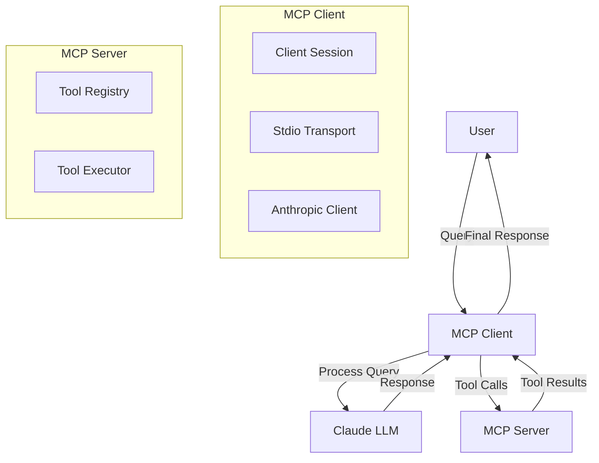

# MCP System Architecture

## Component Diagram

## Component Descriptions

### MCP Client

- **ClientSession**: Manages the connection and communication with the MCP Server
- **StdioTransport**: Handles standard input/output communication with the server
- **AnthropicClient**: Interfaces with Claude LLM for processing queries and tool selection

### MCP Server

- **ToolRegistry**: Maintains a list of available tools and their descriptions
- **ToolExecutor**: Executes the actual tool calls and returns results

### Claude LLM

- Processes user queries
- Determines which tools to use
- Generates responses based on tool results

## Communication Flow

1. User sends a query to the MCP Client
2. Client forwards the query to Claude LLM
3. LLM processes the query and may request tool usage
4. Client makes tool calls to the MCP Server
5. Server executes tools and returns results
6. Results are sent back to LLM for further processing
7. Final response is returned to the user

## Key Features

- Asynchronous communication between components
- Tool-based interaction with the server
- Support for both Python and JavaScript server implementations
- Environment variable configuration via .env file
- Interactive chat loop for user interaction
